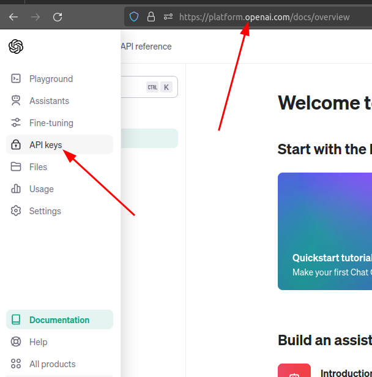
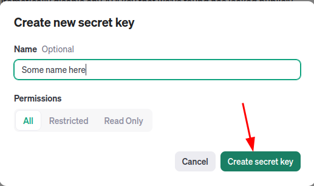

# Semantic Search using OpenAI API & Chromadb

Implementation of Semantic Searching using [OpenAI API embedding](https://platform.openai.com/docs/guides/embeddings) and [ChromaDB](https://docs.trychroma.com/) as a vector database

# Set-up

## Python Dependencies

All the dependencies are in the [pyproject.toml](./pyproject.toml) file. Just install [poetry](https://python-poetry.org/docs/) and run `$ poetry install`

## OpenAI API

1. Go to the [https://platform.openai.com/docs/](https://platform.openai.com/) and on the menu select `API Keys`



2. Click on `Create a new secret key` and `Create secret key`



3. Save the secret key in a file called `.env`:

```text
API_KEY=YOUR_KEY_HERE
```
## Running

1. Activate the environment shell: `$ poetry shell`
2. Run a jupyter session: `$ jupyter-notebook` 
3. Open the jupyter notebook [notebooks/Semantic-Searching.ipynb](./notebooks/Semantic-Searching.ipynb) (there is the result inside the jupyter notebook)

## Dataset

Kowsari, Kamran; Brown, Donald; Heidarysafa, Mojtaba ; Jafari Meimandi, Kiana ; Gerber, Matthew; Barnes, Laura (2018), “Web of Science Dataset”, Mendeley Data, V6, doi: [10.17632/9rw3vkcfy4.6](https://data.mendeley.com/datasets/9rw3vkcfy4/6)